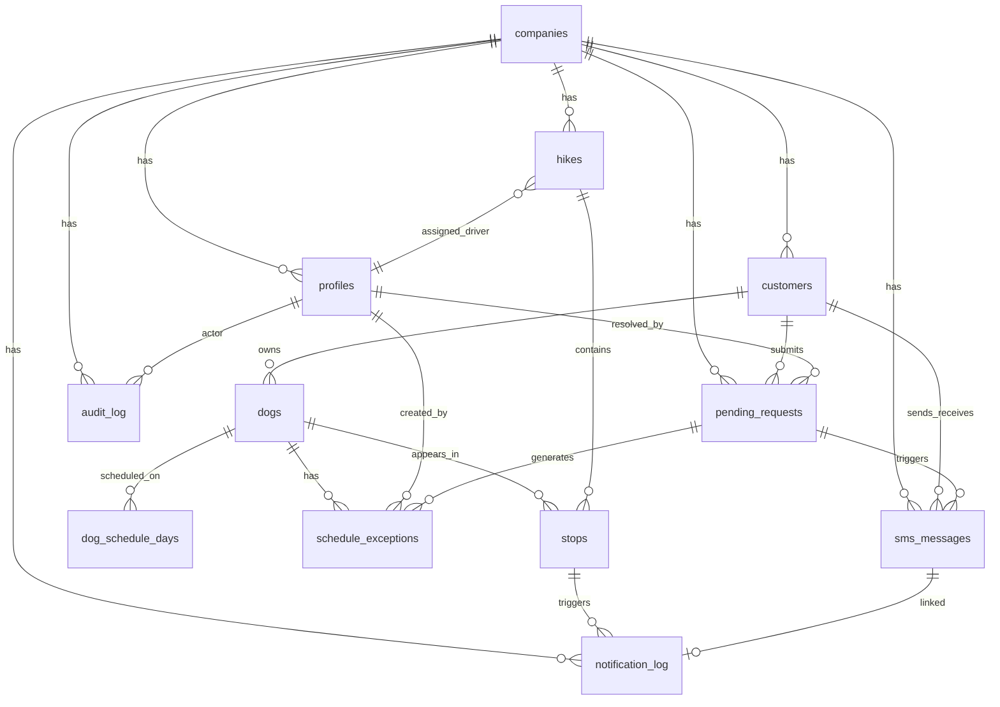

# PackRoute — Database Design (Phase 2)

> **Status:** Phase 2 complete. SQL migrations follow in Phase 3.
> **Last updated:** 2025-06-25

---

## 1. Product Decisions (Locked)

| Decision | Answer |
|----------|--------|
| Tenancy | Single company for MVP; `company_id` on all tenant tables |
| Pickup windows | Per dog (`pickup_window_start`, `pickup_window_end`) |
| SMS skip scope | Customer-level — applies to **all active dogs** for that customer |
| Drivers | One vehicle / one hike per day; one assigned driver. Co-walkers share the device |
| Timezone | One timezone per company; default `America/Los_Angeles` |
| Route order | Admin drag-and-drop; default on `dogs.route_sort_order`, per-day override on `stops.sort_order`. Drop-offs use reverse pickup order. |

---

## 2. Entity Relationship Overview

```
companies
    │
    ├── profiles (users: admin | driver) ──────────────┐
    │                                                   │
    ├── customers                                       │
    │     └── dogs                                      │
    │           ├── dog_schedule_days (recurring)       │
    │           └── schedule_exceptions                 │
    │                                                   │
    ├── hikes (one per calendar day) ◄──────────────────┘
    │     └── stops (pickup + dropoff per dog)
    │
    ├── pending_requests (from inbound SMS)
    ├── sms_messages (inbound + outbound)
    ├── notification_log
    └── audit_log
```

**Central idea:** Dogs have recurring days and optional exceptions. Each morning, the system materializes a **hike** (today's run) with **stops** derived from active dogs scheduled that day, minus exceptions. Drivers mutate stop status; notifications and SMS hang off those events.

---

## 3. Drivers vs Users

The product spec lists "Drivers" separately, but drivers **are authenticated users** with `role = 'driver'`. A separate `drivers` table would duplicate data with no benefit for MVP.

| Concept | Implementation |
|---------|----------------|
| Office admin | `profiles.role = 'admin'` |
| Dog walker | `profiles.role = 'driver'` |
| Two walkers in one van | Share one logged-in device; one `hikes.driver_id` |

If we later need per-walker accountability, we can add a `hike_co_drivers` join table without changing the core model.

---

## 4. Table Definitions

### 4.1 `companies`

Single row for MVP. Exists so multi-location can be added without migration.

| Column | Type | Notes |
|--------|------|-------|
| `id` | `uuid` PK | |
| `name` | `text` NOT NULL | e.g. "PackRoute" |
| `timezone` | `text` NOT NULL DEFAULT `'America/Los_Angeles'` | IANA timezone |
| `default_pickup_window_start` | `time` | Fallback when creating new dogs |
| `default_pickup_window_end` | `time` | Fallback when creating new dogs |
| `twilio_phone_number` | `text` | Outbound/inbound company number (E.164) |
| `created_at` | `timestamptz` | |
| `updated_at` | `timestamptz` | |

---

### 4.2 `profiles`

Extends Supabase Auth.users. Created via trigger on signup.

| Column | Type | Notes |
|--------|------|-------|
| `id` | `uuid` PK | FK → `auth.users(id)` ON DELETE CASCADE |
| `company_id` | `uuid` NOT NULL | FK → `companies(id)` |
| `role` | `user_role` NOT NULL | `admin` \| `driver` |
| `full_name` | `text` NOT NULL | |
| `phone` | `text` | Optional contact number |
| `is_active` | `boolean` NOT NULL DEFAULT `true` | Soft-disable without deleting auth |
| `created_at` | `timestamptz` | |
| `updated_at` | `timestamptz` | |

**Indexes:** `(company_id)`, `(company_id, role)`

---

### 4.3 `customers`

| Column | Type | Notes |
|--------|------|-------|
| `id` | `uuid` PK | |
| `company_id` | `uuid` NOT NULL | FK → `companies(id)` |
| `owner_name` | `text` NOT NULL | |
| `phone` | `text` NOT NULL | E.164 normalized, e.g. `+15551234567` |
| `secondary_owner_name` | `text` | Optional second contact name |
| `secondary_phone` | `text` | Optional second contact phone |
| `email` | `text` | Optional |
| `address` | `text` NOT NULL | Full street address for ETA |
| `address_lat` | `double precision` | Geocoded on save |
| `address_lng` | `double precision` | Geocoded on save |
| `notes` | `text` | |
| `is_active` | `boolean` NOT NULL DEFAULT `true` | |
| `night_before_reminders_enabled` | `boolean` NOT NULL DEFAULT `true` | When `false`, skip ~6 PM night-before SMS; ETA/pickup texts unchanged |
| `created_at` | `timestamptz` | |
| `updated_at` | `timestamptz` | |

**Constraints:**
- `UNIQUE (company_id, phone)` — one customer per phone per company; SMS lookup key

**Indexes:** `(company_id, is_active)`, `(company_id, owner_name)` for search

---

### 4.4 `dogs`

| Column | Type | Notes |
|--------|------|-------|
| `id` | `uuid` PK | |
| `company_id` | `uuid` NOT NULL | FK → `companies(id)` |
| `customer_id` | `uuid` NOT NULL | FK → `customers(id)` ON DELETE RESTRICT |
| `name` | `text` NOT NULL | |
| `breed` | `text` | |
| `notes` | `text` | |
| `is_active` | `boolean` NOT NULL DEFAULT `true` | |
| `pickup_window_start` | `time` NOT NULL | Per-dog window, e.g. `08:00` |
| `pickup_window_end` | `time` NOT NULL | e.g. `08:30` |
| `route_sort_order` | `integer` NOT NULL DEFAULT `0` | Default route position; lower = earlier. Admin drag-and-drop |
| `created_at` | `timestamptz` | |
| `updated_at` | `timestamptz` | |

**Indexes:** `(customer_id)`, `(company_id, is_active)`, `(company_id, route_sort_order)`

---

### 4.5 `dog_schedule_days` (Recurring Schedule)

Normalized M:N between dogs and weekdays. A dog on Mon/Tue/Thu has three rows.

| Column | Type | Notes |
|--------|------|-------|
| `id` | `uuid` PK | |
| `dog_id` | `uuid` NOT NULL | FK → `dogs(id)` ON DELETE CASCADE |
| `day_of_week` | `smallint` NOT NULL | `0 = Sunday` … `6 = Saturday` (PostgreSQL `extract(dow)` convention) |
| `created_at` | `timestamptz` | |

**Constraints:**
- `UNIQUE (dog_id, day_of_week)`
- `CHECK (day_of_week BETWEEN 0 AND 6)`

---

### 4.6 `schedule_exceptions`

Overrides recurring schedule. Created manually by admin or automatically when a pending request is approved.

| Column | Type | Notes |
|--------|------|-------|
| `id` | `uuid` PK | |
| `dog_id` | `uuid` NOT NULL | FK → `dogs(id)` ON DELETE CASCADE |
| `exception_type` | `exception_type` NOT NULL | `skip_date` \| `vacation` \| `pause` |
| `start_date` | `date` NOT NULL | Inclusive |
| `end_date` | `date` | Inclusive; `NULL` = open-ended pause |
| `reason` | `text` | Admin or parsed command notes |
| `pending_request_id` | `uuid` | FK → `pending_requests(id)` — provenance |
| `created_by` | `uuid` | FK → `profiles(id)` — admin who approved |
| `created_at` | `timestamptz` | |

**Semantics:**

| Type | Example | Effect |
|------|---------|--------|
| `skip_date` | Skip July 12 | `start_date = end_date = July 12` |
| `vacation` | July 10–18 | No stops generated for any date in range |
| `pause` | PAUSE FOR NOW | `end_date IS NULL` until resume |
| Resume | RESUME / BACK ON | Sets `end_date` on active pause (application logic) |

**Indexes:** `(dog_id, start_date, end_date)` — exception lookup during stop generation

---

### 4.7 `hikes`

One hike = one operational day for the company's van.

| Column | Type | Notes |
|--------|------|-------|
| `id` | `uuid` PK | |
| `company_id` | `uuid` NOT NULL | FK → `companies(id)` |
| `date` | `date` NOT NULL | Calendar date in company timezone |
| `driver_id` | `uuid` | FK → `profiles(id)` — assigned walker |
| `status` | `hike_status` NOT NULL DEFAULT `'planned'` | `planned` \| `in_progress` \| `completed` |
| `notes` | `text` | |
| `created_at` | `timestamptz` | |
| `updated_at` | `timestamptz` | |

**Constraints:**
- `UNIQUE (company_id, date)` — one van run per day for MVP

**Indexes:** `(company_id, date)`, `(driver_id, date)`

---

### 4.8 `stops`

Materialized pickup/dropoff events for a hike. Generated from schedule − exceptions.

| Column | Type | Notes |
|--------|------|-------|
| `id` | `uuid` PK | |
| `hike_id` | `uuid` NOT NULL | FK → `hikes(id)` ON DELETE CASCADE |
| `dog_id` | `uuid` NOT NULL | FK → `dogs(id)` |
| `stop_type` | `stop_type` NOT NULL | `pickup` \| `dropoff` |
| `status` | `stop_status` NOT NULL DEFAULT `'scheduled'` | See state machine below |
| `window_start` | `time` NOT NULL | Snapshot of dog's pickup window at generation |
| `window_end` | `time` NOT NULL | Snapshot at generation |
| `en_route_at` | `timestamptz` | When driver tapped En Route |
| `completed_at` | `timestamptz` | When picked up / dropped off |
| `driver_lat` | `double precision` | GPS at En Route |
| `driver_lng` | `double precision` | GPS at En Route |
| `eta_minutes` | `integer` | Cached ETA sent to customer |
| `sort_order` | `integer` NOT NULL | Route position for this hike. Copied from `dogs.route_sort_order` at generation; admin can reorder per day |
| `created_at` | `timestamptz` | |
| `updated_at` | `timestamptz` | |

**Constraints:**
- `UNIQUE (hike_id, dog_id, stop_type)`
- `UNIQUE (hike_id, stop_type, sort_order)` — one position per slot within pickup or dropoff list

**Stop status state machine:**

```
pickup:  scheduled → en_route → picked_up
                              ↘ skipped / cancelled

dropoff: scheduled → en_route → dropped_off
                              ↘ skipped / cancelled
```

Using distinct terminal statuses (`picked_up` vs `dropped_off`) makes notification triggers and dashboard filters explicit.

**Indexes:** `(hike_id, stop_type, sort_order)`, `(hike_id, stop_type, status)`, `(dog_id)`

**Route order:** Pickup stops use `sort_order` ascending (0 = first pickup). Dropoff stops use the **reverse** of pickup order (last pickup = first dropoff). Driver UI lists each type `ORDER BY sort_order`. Admin reorders pickups via drag-and-drop on the default route (updates `dogs.route_sort_order` and resyncs today/tomorrow) or on a specific day (updates pickup `stops.sort_order`; dropoffs follow automatically).

---

### 4.9 `pending_requests`

Customer SMS commands awaiting admin approval. **Customer-scoped**, not dog-scoped.

| Column | Type | Notes |
|--------|------|-------|
| `id` | `uuid` PK | |
| `company_id` | `uuid` NOT NULL | FK → `companies(id)` |
| `customer_id` | `uuid` NOT NULL | FK → `customers(id)` |
| `raw_body` | `text` NOT NULL | Original SMS text |
| `command_type` | `command_type` NOT NULL | Parsed command enum |
| `parsed_payload` | `jsonb` NOT NULL DEFAULT `'{}'` | Dates, weekday, etc. |
| `status` | `request_status` NOT NULL DEFAULT `'pending'` | `pending` \| `approved` \| `declined` |
| `resolved_by` | `uuid` | FK → `profiles(id)` |
| `resolved_at` | `timestamptz` | |
| `admin_notes` | `text` | Optional decline reason |
| `idempotency_key` | `text` NOT NULL | Dedup key (see §8) |
| `created_at` | `timestamptz` | |

**Approval behavior:** When approved, the system creates one `schedule_exception` per **active dog** belonging to `customer_id`.

**Indexes:** `(company_id, status, created_at DESC)`, `UNIQUE (idempotency_key)`

---

### 4.10 `sms_messages`

Unified log for inbound and outbound SMS. Replaces a separate "incoming_sms" table — filter by `direction`.

| Column | Type | Notes |
|--------|------|-------|
| `id` | `uuid` PK | |
| `company_id` | `uuid` NOT NULL | FK → `companies(id)` |
| `customer_id` | `uuid` | FK → `customers(id)` — null for unmatched inbound |
| `direction` | `sms_direction` NOT NULL | `inbound` \| `outbound` |
| `from_number` | `text` NOT NULL | E.164 |
| `to_number` | `text` NOT NULL | E.164 |
| `body` | `text` NOT NULL | |
| `twilio_sid` | `text` | `UNIQUE` when present |
| `status` | `sms_status` NOT NULL DEFAULT `'received'` | `received` \| `queued` \| `sent` \| `delivered` \| `failed` |
| `error_message` | `text` | |
| `pending_request_id` | `uuid` | FK → `pending_requests(id)` — links inbound to request |
| `created_at` | `timestamptz` | |

**Indexes:** `(company_id, created_at DESC)`, `(customer_id, created_at DESC)`, `(twilio_sid)`

---

### 4.11 `notification_log`

Every automated notification (SMS or future channels). Outbound SMS also creates an `sms_messages` row; this table is the business-level audit.

| Column | Type | Notes |
|--------|------|-------|
| `id` | `uuid` PK | |
| `company_id` | `uuid` NOT NULL | FK → `companies(id)` |
| `customer_id` | `uuid` | FK → `customers(id)` |
| `dog_id` | `uuid` | FK → `dogs(id)` |
| `stop_id` | `uuid` | FK → `stops(id)` |
| `notification_type` | `notification_type` NOT NULL | See enum below |
| `channel` | `text` NOT NULL DEFAULT `'sms'` | |
| `body` | `text` NOT NULL | Rendered message |
| `status` | `notification_status` NOT NULL | `pending` \| `sent` \| `failed` |
| `error_message` | `text` | |
| `sms_message_id` | `uuid` | FK → `sms_messages(id)` |
| `created_at` | `timestamptz` | |

**`notification_type` values:**
`night_before` · `en_route` · `picked_up` · `dropped_off` · `request_received` · `request_approved` · `request_declined` · `help`

**Indexes:** `(company_id, created_at DESC)`, `(customer_id, created_at DESC)`, `(stop_id)`

---

### 4.12 `audit_log`

Admin and system actions for compliance and debugging.

| Column | Type | Notes |
|--------|------|-------|
| `id` | `uuid` PK | |
| `company_id` | `uuid` NOT NULL | FK → `companies(id)` |
| `actor_id` | `uuid` | FK → `profiles(id)` — null for system/cron |
| `action` | `text` NOT NULL | e.g. `pending_request.approved`, `dog.updated` |
| `entity_type` | `text` NOT NULL | e.g. `pending_request`, `dog`, `schedule_exception` |
| `entity_id` | `uuid` NOT NULL | |
| `metadata` | `jsonb` NOT NULL DEFAULT `'{}'` | Before/after snapshots, etc. |
| `created_at` | `timestamptz` | |

**Indexes:** `(company_id, created_at DESC)`, `(entity_type, entity_id)`

---

## 5. PostgreSQL Enums

```sql
CREATE TYPE user_role AS ENUM ('admin', 'driver');

CREATE TYPE exception_type AS ENUM ('skip_date', 'vacation', 'pause');

CREATE TYPE hike_status AS ENUM ('planned', 'in_progress', 'completed');

CREATE TYPE stop_type AS ENUM ('pickup', 'dropoff');

CREATE TYPE stop_status AS ENUM (
  'scheduled', 'en_route', 'picked_up', 'dropped_off', 'skipped', 'cancelled'
);

CREATE TYPE command_type AS ENUM (
  'skip_tomorrow', 'skip_weekday', 'skip_date',
  'vacation', 'pause', 'resume', 'help', 'unknown'
);

CREATE TYPE request_status AS ENUM ('pending', 'approved', 'declined');

CREATE TYPE sms_direction AS ENUM ('inbound', 'outbound');

CREATE TYPE sms_status AS ENUM ('received', 'queued', 'sent', 'delivered', 'failed');

CREATE TYPE notification_type AS ENUM (
  'night_before', 'en_route', 'picked_up', 'dropped_off',
  'request_received', 'request_approved', 'request_declined', 'help'
);

CREATE TYPE notification_status AS ENUM ('pending', 'sent', 'failed');
```

---

## 6. Relationship Summary

| From | To | Cardinality | Notes |
|------|----|-------------|-------|
| `companies` | `profiles` | 1:N | All staff belong to one company |
| `companies` | `customers` | 1:N | |
| `customers` | `dogs` | 1:N | |
| `dogs` | `dog_schedule_days` | 1:N | One row per weekday |
| `dogs` | `schedule_exceptions` | 1:N | |
| `companies` | `hikes` | 1:N | One hike per date (MVP) |
| `hikes` | `stops` | 1:N | Up to 2 stops per dog (pickup + dropoff) |
| `stops` | `dogs` | N:1 | |
| `hikes` | `profiles` (driver) | N:1 | Assigned walker |
| `customers` | `pending_requests` | 1:N | |
| `pending_requests` | `schedule_exceptions` | 1:N | One exception per dog on approve |
| `customers` | `sms_messages` | 1:N | |
| `stops` | `notification_log` | 1:N | ETA, pickup, dropoff texts |

---

## 7. Core Workflows (Data Flow)

### 7.1 Nightly stop generation (cron, ~midnight company TZ)

```
FOR date = tomorrow IN company timezone:
  INSERT hike ON CONFLICT (company_id, date) DO NOTHING

  FOR each active dog:
    IF day_of_week IN dog_schedule_days
       AND NOT blocked BY schedule_exceptions:
      INSERT stop (pickup)  — snapshot window + sort_order from dog.route_sort_order
      INSERT stop (dropoff) — same window; sort_order = reverse of pickup position
```

Exceptions block generation when `date BETWEEN start_date AND COALESCE(end_date, 'infinity')`.

### 7.2 Night-before SMS (~6 PM company TZ)

```
FOR each stop WHERE hike.date = tomorrow AND stop_type = 'pickup':
  IF customer.night_before_reminders_enabled = false: SKIP
  SEND "Rawley is scheduled for pickup tomorrow between {window}."
  LOG notification_log + sms_messages
```

Customers can opt out via SMS (STOP REMINDERS) or admin toggles the customer profile.
ETA and pickup/drop-off texts are unaffected.

### 7.3 Driver En Route

```
PATCH stop SET status = 'en_route', driver_lat, driver_lng, en_route_at = now()
CALCULATE ETA → customer.address_lat/lng
SEND "Hi Wade! We're on the way to pick up Rawley. ETA ~12 min."
LOG notification_log + sms_messages
SET hike.status = 'in_progress' IF planned
```

### 7.4 Inbound SMS → Pending Request

```
MATCH phone → customer
PARSE body → command_type + parsed_payload
IF help → reply immediately, NO pending_request
IF STOP REMINDERS / START REMINDERS → UPDATE customer.night_before_reminders_enabled, reply immediately, NO pending_request
IF unknown → reply with HELP text, NO pending_request
ELSE:
  INSERT pending_request (customer-scoped)
  INSERT sms_messages (inbound)
  REPLY "Got it! We'll review your request shortly."
```

### 7.5 Admin Approve Skip

```
BEGIN TRANSACTION
  UPDATE pending_request SET status = 'approved', resolved_by, resolved_at
  FOR each active dog OF customer:
    INSERT schedule_exception (derived from parsed_payload)
  DELETE future stops for affected dates (or mark cancelled)
  SEND confirmation SMS
  INSERT audit_log
COMMIT
```

Use optimistic locking: `UPDATE ... WHERE status = 'pending'` — if 0 rows, return 409.

---

## 8. Idempotency & Deduplication

**Inbound SMS duplicate protection:**

```
idempotency_key = sha256(from_number + normalize(body) + floor_to_minute(received_at))
UNIQUE constraint on pending_requests.idempotency_key
```

If duplicate detected within the same minute bucket, return 200 to Twilio without creating a second request.

**Twilio webhook:** Also dedupe on `sms_messages.twilio_sid UNIQUE`.

**Driver actions:** PATCH stop status is idempotent — completing an already-completed stop returns current state without re-sending SMS.

---

## 9. Indexing Strategy

| Query pattern | Index |
|---------------|-------|
| SMS lookup by phone | `customers (company_id, phone)` UNIQUE |
| Today's stops for driver | `stops (hike_id, stop_type, sort_order)` |
| Pending requests dashboard | `pending_requests (company_id, status, created_at DESC)` |
| SMS/notification history | `(company_id, created_at DESC)` on both log tables |
| Exception check at generation | `schedule_exceptions (dog_id, start_date, end_date)` |
| Audit trail for entity | `audit_log (entity_type, entity_id)` |

---

## 10. Row Level Security (Overview)

Full policies ship in Phase 3 migrations. Design intent:

| Role | Access |
|------|--------|
| `admin` | Full CRUD on all company rows |
| `driver` | Read hikes/stops for assigned hikes (today + tomorrow); update stop status only |
| `service_role` | Bypass RLS — webhooks, cron, approval side-effects |
| `anon` / unauthenticated | No direct table access |

Helper function: `auth.user_company_id()` reads from `profiles` where `id = auth.uid()`.

---

## 11. ER Diagram



---

## 12. Seed Data (MVP)

Phase 3 migration will include a seed for local development:

- 1 company ("PackRoute", `America/Los_Angeles`)
- 1 admin profile (linked to auth user manually or via seed script)
- 1 driver profile
- 2–3 sample customers with dogs and recurring schedules

Production: admin creates company row and first admin via setup script.

---

## 13. What We Deliberately Did NOT Model (MVP)

| Omitted | Reason |
|---------|--------|
| Separate `drivers` table | Drivers are `profiles` with a role |
| Separate `incoming_sms` table | Unified in `sms_messages` with `direction` |
| Dropoff time windows | Spec only requires pickup windows; dropoff stops use same window snapshot |
| Co-driver assignment | Shared device for MVP |
| Customer auth | Customers interact via SMS only |
| Payments / invoices | Future feature |

---

## 14. Phase Status

| Phase | Deliverable | Status |
|-------|-------------|--------|
| 1 | Product architecture | ✅ Complete |
| 2 | Database design (this document) | ✅ Complete |
| 3 | Supabase SQL migrations | ✅ Complete |
| 4 | Next.js scaffold | **Next** |
